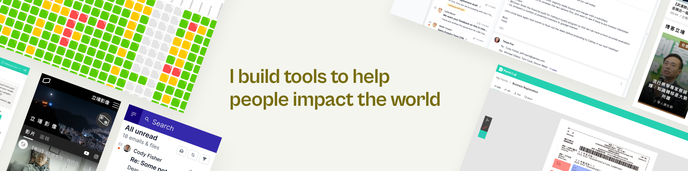
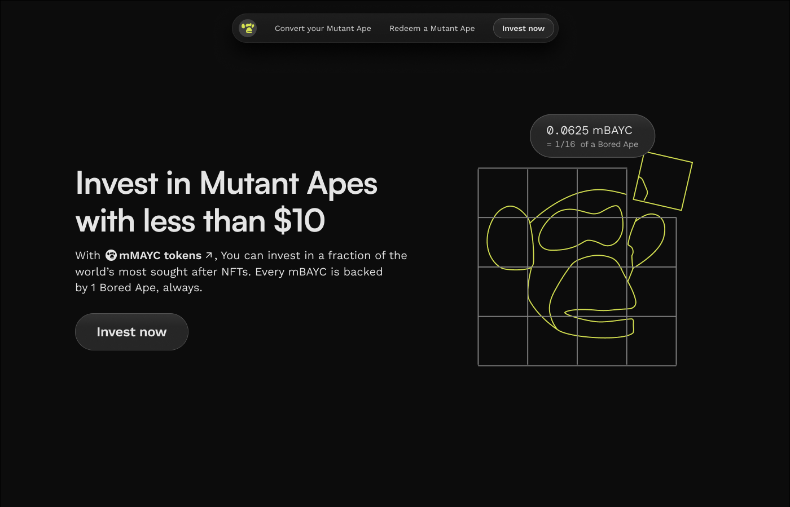
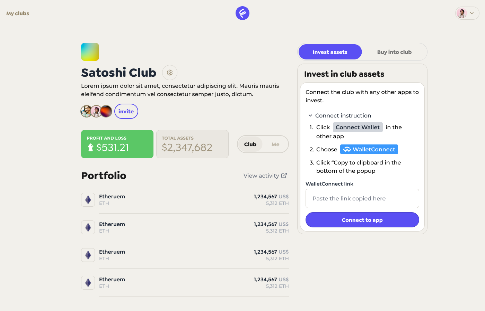

### 👋  I'm Eugene and I'm a designer-engineer (check out my [design work](https://www.eugenechantk.me/))
[](https://www.eugenechantk.me/)

### 🌱 About me...
- 🎨 🖥️  Product designer (3yrs exp) turn software engineer (1 yr exp)
- 🧡  Passionate about AI, Web3 and Education -- Impacting the people who impact the world
- 🚴‍♀️  On weekends, find me on my bike around the city, hiking up or snowboarding down mountains

### 🔭 I’m working on...
```
💡 I am passionate in helping problem solvers build their own tools, with the help of AI 
```

**Right now, I am building products that...**
- ⚒️ Enable people to build their own tools with the help of AI
- 🤝 Give us more observability and interpretability when working with AI
- ⛓️ Interoprability of data we have and content we generate

Most recently, I built...
| **OfflineGPT** | **NaviGator** |
|:---:|:---:|
| [](https://llm-to-sms.vercel.app/)| [](https://devpost.com/software/glados-60a7s3) |
| Expose any LLM chat as a SMS number | Debugger for building AI agents - 🏆 Winner of Amplitude's AI hackathon |

Before that, I built consumer-facing Web3 applications like...
| **Apex Labs** | **frens** |
|:---:|:---:|
| [](https://mnft.vercel.app/)| [](https://www.joinfrens.xyz/) |
| Apex Labs - fractionalizing the most valuable digital assets | frens - Invest in digital assets with friends, easy |

### 💪 I’m good at...
<p>
  
  
  
  
  
  
  
  
  
  
  
  
</p>

### 📫 How to reach me...
- me@eugenechantk.me
- @eugenechantk on all socials
